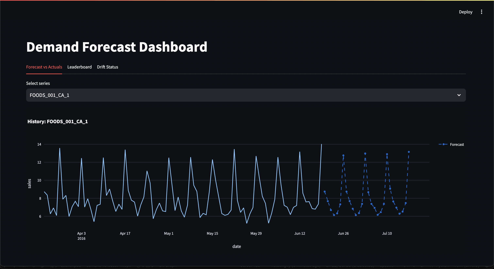
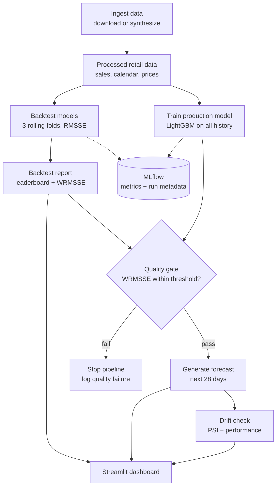

# Demand Forecast MLOps

An end-to-end demand forecasting pipeline for retail sales, built with reproducible
training, experiment tracking, a model quality gate, drift monitoring, and a
Streamlit dashboard.

The project forecasts product-level demand 28 days ahead on M5-style retail data.
It compares classical baselines with LightGBM using rolling-origin backtesting and
orchestrates the production workflow through an Airflow DAG.

This is intentionally compact: the full pipeline runs on a laptop in seconds, and
all modeling logic lives in `src/forecast/`. The notebook is exploratory only and
imports reusable code from the package.

## Demo



## Business Context

Retail teams need reliable short-term forecasts to decide how much inventory to
order, how to staff stores, and when to prepare for demand spikes. Under-forecasting
causes stockouts and lost sales; over-forecasting creates excess inventory, spoilage,
and markdown risk.

This project models that problem at the product-store-day level:

- Forecast horizon: 28 days
- Granularity: one product at one store per day
- Example slice: 200 food products from store `CA_1`
- Target: daily unit sales

## Data

The dataset is based on the
[M5 Forecasting competition](https://www.kaggle.com/competitions/m5-forecasting-accuracy),
which contains Walmart US sales data from 2011 to 2016. Each time series represents
one product at one store.

When you run `make data`, `src/forecast/ingest.py` performs the following steps:

```text
1. Try to download the real M5 dataset from Kaggle
   Requires kagglehub and Kaggle API credentials

2. If Kaggle access is unavailable, generate synthetic M5-shaped data
   This keeps the project runnable without external credentials

3. Slice the data to one store (CA_1), one category (FOODS), and 200 products

4. Save processed parquet files under data/processed/
```

Most local runs will use synthetic data by default. The synthetic data is not real
Walmart sales, but it preserves the structure needed to exercise the same pipeline,
feature logic, metrics, and monitoring checks. To run against real M5 data, configure
[Kaggle API credentials](https://www.kaggle.com/docs/api) and rerun `make data`.

### Main Modeling Table

After ingestion, the primary dataset is `data/processed/sales_long.parquet`, with
one row per product per day.

| Column | Description |
|--------|-------------|
| `id` | Product-store series identifier, for example `FOODS_042_CA_1` |
| `item_id`, `dept_id` | Product and department identifiers |
| `day_idx` | Sequential day number |
| `date` | Calendar date |
| `sales` | Units sold that day; this is the forecasting target |
| `snap_CA` | Indicator for SNAP benefit days in California |
| `event_name_1` | Holiday or event label, when available |
| `sell_price` | Product price for the week |

The dashboard, backtest metrics, and 28-day forecasts all operate on these daily
sales series.

### Generated Data Assets

```text
data/
├── raw/                          # original CSVs, real or synthetic
│   ├── sales_train_evaluation.csv
│   ├── calendar.csv
│   └── sell_prices.csv
└── processed/
    ├── sales_long.parquet        # main modeling table, long format
    ├── sales_slice.parquet       # wide slice, 200 series x 1969 days
    ├── series_meta.parquet       # per-series metadata and sales weights
    └── calendar.parquet
```

The `data/` directory is gitignored and generated locally with `make data`.

## Architecture



The Airflow DAG wraps the same command-line entry points used locally. This keeps
the orchestration layer thin and leaves business logic in the tested Python package.
The backtest produces the quality evidence, the production training step fits the
model used for forecasting, and the quality gate decides whether forecasts should be
published.

## Results

The reported benchmark uses a 3-fold rolling-origin backtest, a 28-day forecast
horizon, and 200 product-store series. Each model is refit for every fold.

| Model | RMSSE (mean +/- std) | Weighted RMSSE | sMAPE | Train time |
|-------|----------------------|----------------|-------|------------|
| Seasonal naive (7d) | 0.750 +/- 0.003 | 0.480 | 62.9 | 0.2s |
| Moving average (28d) | 0.755 +/- 0.003 | 0.748 | 55.9 | 0.1s |
| **LightGBM** | **0.547 +/- 0.003** | **0.357** | **50.8** | 7.1s |

LightGBM improves weighted RMSSE by approximately **26%** versus the seasonal naive
baseline. The gain comes primarily from calendar-aware features: SNAP days and event
days can shift demand in ways that simple "repeat last week" logic cannot anticipate.

Highly intermittent series remain challenging, and simple baselines can still be
competitive when there is little signal beyond the base sales rate. MAPE is omitted
because many retail series contain zero-sales days; RMSSE and sMAPE are more stable
for this setting.

These numbers are from the bundled synthetic M5-shaped data. Re-run `make backtest`
after configuring Kaggle access to evaluate on the real M5 dataset.

## Key Design Decisions

- **Direct 28-day forecasting.** Features use lags of 28 days or more, including
  lag-28, lag-35, lag-42, and shifted rolling statistics. This lets one model predict
  the full 28-day horizon without recursive forecasting.
- **Leakage-safe features.** At prediction day `t`, every feature references data no
  newer than `t - 28`, which is at or before the training cutoff. This is enforced by
  `assert_no_leakage` and tested in `tests/test_backtest.py`.
- **Model quality gate.** The Airflow `evaluate` task blocks forecast generation if
  the current LightGBM backtest WRMSSE regresses by more than 10% relative to the last
  accepted run.
- **Drift monitoring.** The drift report combines PSI on the top features with a
  recent-performance check. PSI warns at 0.20 and flags at 0.25; performance flags
  when recent RMSSE exceeds 1.25x the earlier-fold average.
- **Reproducible tracking.** MLflow records metrics, configuration, git SHA, and a
  dataset hash so forecast runs can be traced back to their inputs.
- **Synthetic fallback.** The ingestion step generates realistic synthetic data when
  Kaggle credentials are unavailable, allowing CI and local demos to run end to end.

## Quickstart

```bash
pip install -e ".[dev,dashboard]"

make data        # ingest data, with synthetic fallback when Kaggle is unavailable
make backtest    # run rolling-origin CV and log results to MLflow
make train       # fit the production LightGBM model
make predict     # generate the 28-day forecast
make drift       # create a drift report
make dashboard   # launch the Streamlit dashboard
make test        # run pytest, including leakage tests

mlflow ui        # browse runs at http://localhost:5000
```

### Airflow

Airflow is optional. It provides scheduled orchestration for the same pipeline steps.

```bash
pip install -e ".[airflow]"
export AIRFLOW_HOME=$PWD/.airflow
airflow standalone

# In another terminal, or for a local DAG smoke test:
make dag-test
```

The DAG is defined in `dags/forecast_pipeline.py` and delegates execution to the
same Python CLIs used by the Makefile.

## Repository Layout

```text
├── configs/default.yaml      # dataset slice, folds, model params, thresholds
├── src/forecast/
│   ├── ingest.py             # download or synthesize data, then write parquet
│   ├── features.py           # leakage-safe lag, rolling, calendar, price features
│   ├── models.py             # seasonal naive, moving average, LightGBM
│   ├── metrics.py            # RMSSE, MASE, sMAPE
│   ├── backtest.py           # rolling-origin CV, leaderboard JSON, MLflow logging
│   ├── train.py / predict.py # production model training and forecasting CLIs
│   ├── drift.py              # PSI and performance drift reporting
│   └── tracking.py           # MLflow helpers for run metadata
├── dags/forecast_pipeline.py # Airflow DAG with quality gate branch
├── dashboard/app.py          # Streamlit dashboard
├── tests/                    # leakage, metrics, features, drift
└── notebooks/01_eda.ipynb    # exploratory analysis only
```

## Testing and CI

| Test | Purpose |
|------|---------|
| `test_backtest.py::test_no_leakage` | Ensures test-period features do not use post-cutoff data |
| `test_backtest.py::test_leakage_detected_for_short_lags` | Verifies the leakage check catches deliberately unsafe lags |
| `test_metrics.py` | Validates RMSSE, MASE, and sMAPE against hand-computed fixtures |
| `test_features.py` | Checks lag and rolling-window behavior at series boundaries |
| `test_drift.py` | Verifies PSI behavior on shifted synthetic distributions |

GitHub Actions runs `ruff`, `pytest`, and an end-to-end pipeline smoke test on every
push.
